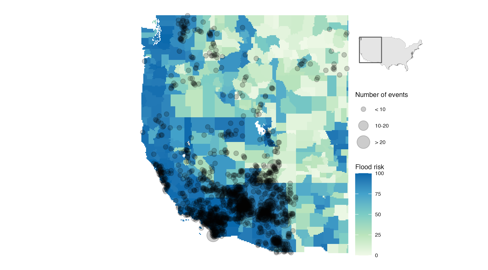
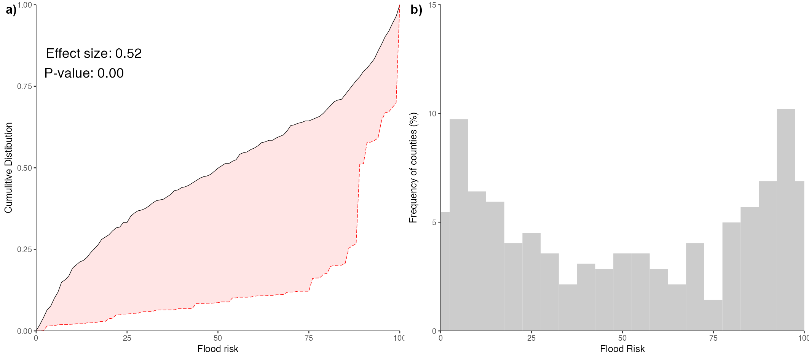
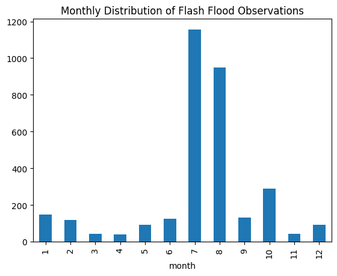
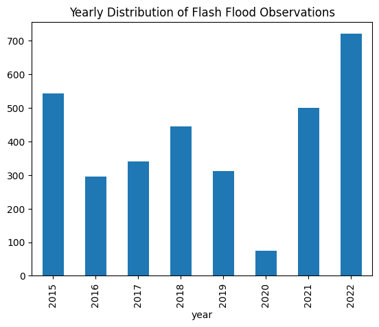

# Data Dirt and Data Draught
**Connecting Communities to Cultivate the Environmental Data Ecosystem**

### Research Question
#### Starting Question
> What gaps/biases are present in environmental data sets that are critical for assessing adaptation and resilence, and how can we address them?

#### Refined Question
> How can we bring together domain expertise (environmental science) with technical expertise (data science and machine learning) to identify and remedy data biases and data gaps in the environmental data ecosystem?

---

### Our Three-Pronged Approach
1. Data-centric machine-learning challenges  
   Inspirations: e.g., [DataPerf](https://www.dataperf.org/home) by [MLCommon's DMLR Group](https://mlcommons.org/working-groups/research/dmlr/) and [ITU AI for Good Challenge](https://aiforgood.itu.int/about-ai-for-good/aiml-solutions-for-climate-change/)
2. Data cards to document environmental datasets  
   Inspiration: Google's [Data Cards Playbook](https://sites.research.google/datacardsplaybook/)
5. Domain experts (researchers and decision-makers)

---

### Guiding Example: Flash-Flood Prediction

#### Description

Flash-flood forecasting is uniquely challenging due to the convergence of large-scale meteorological states, and hyperlocal hydrological conditions. Conversely, predicting flash-flood risks accurately is critical to enable advanced civil warnings to mitigate flood damages. To achieve better predictions, improvements in modeling algorithms are typically pursued. Yet, such investments are likely to offer only an appearance of progress if informed by biased reference data on flash-flood occurrences. Indeed, preliminary results show that these reference data suffer from extensive spatial and temporal gaps and biases. Because these biases prevent an accurate description of the environmental niche contributing to flash floods, modeling efforts are likely to fail in out-of-sample predictions. This limits accurate and timely flash-flood predictions.

#### Illustration: Flash-Flood Data Draught

<figure>
  
  <figcaption><b>Figure 1. Spatial variability in flood risks.</b>  Map of county-level flood risks in the Western Continental USA (location shown by the image on the top right). Overlaying the map as black dots, we see the spatial distribution of flash-flooding events. </figcaption>
</figure>

<figure>
  
  <figcaption><b>Figure 2. Scarcity of flash-flood reference data.</b> In <b>a)</b>, a comparison of the cummulative distributions of flood risks within the region mapped in <b>Fig. 1</b> (black line), and the distribution of this varible as sampled by existing reference data on flash-flood events (red line). The pink polygon illustrates the difference between the two populations. In <b>b)</b>, the freqency distribution of flash-flood risks in the region of interest.</figcaption>
</figure>

<figure>
  
  <figcaption><b>Figure 3. Monthly Distribution of Flash Flood Observations</b>

- **Observation:**
  - Flash flood observations are highest in July and August, indicating a seasonal pattern, likely due to heavy summer rainfall or monsoon activity.
  - There is a noticeable increase in observations in October, suggesting a secondary peak, possibly related to fall weather patterns or tropical storm remnants.
  - **Bias Detection:** The data is heavily skewed towards certain months, which could introduce seasonal bias. This needs to be accounted for in predictive models to avoid overfitting to these months.
  - **Data Gaps:** There are fewer observations in other months, which may represent gaps in data collection or lower flash flood occurrences.
  - </figcaption>
</figure>

<figure>
  
  <figcaption><b>Figure 4. Yearly Distribution of Flash Flood Observations</b>

- **Observation:**
  - The number of observations varies significantly by year, with a noticeable drop in 2020. This might be due to reduced data collection during the COVID-19 pandemic.
  - There is an increasing trend in observations from 2019 to 2022.
  - **Bias Detection:** The drop in 2020 and varying annual counts could introduce temporal bias. It's important to ensure the model can generalize across different years.
  - **Data Gaps:** The low number of observations in 2020 indicates a significant gap, which could affect the reliability of long-term trend analysis.</figcaption>
</figure>

#### Challenge Datasets

* Flash Flood Observations: 2010-2024 via National Weather Service (NWS) Local Storm Reports dataset and local office databases
* Historical Precipitation Data: sources - Archived Radar Precipitation Estimates, Analysis of Record Precipitation Data, Archived Precipitation Estimates
* National Risk Index map Author: Federal Emergency Management Agency (FEMA) source: https://hazards.fema.gov/nri/riverine-flooding
* Flash Flood Potential Risk Index: source - National Weather Service River Forecast Centers
* Archived River Gage Data: source - U.S. Geological Society
* Flash Flood Monitoring and Prediction Delineated Basins: Source - NOAA National Severe Storms Laboratory

However, these data often have severe limitations (e.g., areas prone to flash flooding have highly biased precipitation data due to limited radar data coverage and a sparse observational network). 

#### Example Objectives
1. Mitigating data draughts: Identify specific areas to add NOAA sensors
2. Mitigating data dirt: Select subset of data used to train models that improves the performance of flash-flood-prediction models (another option - develop a historical flash flood precipitation dataset that mitigates the highly biased precipitation and flash flood observation data in critical flash flood areas)

#### Evaluation
Each submission will be scored considering the three aspects listed below:

1. Performance improvement
How much does the model improve with regard to performance?

2. Holistic evaluation
How much does the model improve with regard to other evaluation criteria, such as fairness, data efficiency, parameter efficiency, and energy efficiency?

3. Practicality and novelty of the proposed procedure

Participants are required to submit: 

- The developed code
- A challenge-dependent output deliverable
- A written report explaining the solution

#### Further Example Questions
1. Do teleconnections (e.g., El Nino/La Nina) impact water supply for Lake Mead and Lake Powell?  
Example datasets: historical reservoir inflow volumes, historical teleconnection indices
2. Which geographic area would benefit most from a prescribed burn?  
Example datasets: comparison of similar forests that have had different management practices
3. Weather models vs. climatology: Do long-term weather-model ensembles improve water-supply forecasts for the Colorado River?  
Example datasets: Archived ensemble forecasts covering the 6-9 months forecast period + Colorado River water supply re-forecasts – one generated using climatology and the other using archived weather-ensemble output

---

### Future Plans

#### What are the next steps?

Short-term: 

- Initiate contact with ML community to lay groundwork for creating challenges
- Write vision paper: create a template for challenges and how to incorporate ESIIL / scientific community
  
Long-term:

- Create a challenge that is hosted bu AI for good or other
- Create a formal template for scientists to submit challenges to ML community via ESIIL platform

#### What are we missing?
- Resources: Funding for challenge prizes?
- People: AI / ML community

---

### Our Team: Data Dragons

- **Member 1:**
  - **Name:** Anna LoPresti
  - **Pronouns:** She/her
  - **Expertise:** Wildfire and prescribed fire management; climate adaptation planning, monitoring, and evaluation
  - **Environmental Data Science Superpower:** Communicating environmental science to decision-makers; using observational data to evaluate adaptation effectiveness
  - **Reflection on Polarities Exercise:** I was on a call during the exercise - I learned to not double-book myself in the future!
  ---

- **Member 2:**
  - **Name:** Elshadai Tegegn
  - **Pronouns:** She/her
  - **Expertise:** PhD candidate (CS) focusing on XAI
  - **Environmental Data Science Superpower:** Interested in contributing to the field and finding ways to integrate environmental studies with my research
  - **Reflection on Polarities Exercise:** Internal Processor sending long emails because I process while I write
  ---

- **Member 3:**
  - **Name:** Khai Hoan Nguyen
  - **Pronouns:** She/her
  - **Expertise:** Climate adaptation governance; planning and policy
  - **Environmental Data Science Superpower:** Making institutional arrangements legible
  - **Reflection on Polarities Exercise:** Some dimensions I was very sure about, some I was on the fence.
  ---

- **Member 4:**
  - **Name:** Nanette Hosenfeld
  - **Pronouns:** She/her
  - **Expertise:** Meteorologist - forecasting weather, wildfire potential, river flooding, and water supply (snowpack runoff) for the Colorado River and Great Basin
  - **Environmental Data Science Superpower:** Data processing and analysis, web design - mainly geospatial
  - **Reflection on Polarities Exercise:** Missed this but now I'm curious
  ---

- **Member 5:**
  - **Name:** Ruben Remelgado
  - **Pronouns:** He/him
  - **Expertise:** Remote Sensing, Biodiversity Change, Multi and cross-disciplinary studies
  - **Environmental Data Science Superpower:** Data integration and synthesis across disciplines; wrangling of geospatial environmental data  
  - **Reflection on Polarities Exercise:** A lot of movement in the room; very mixed crowd.
  ---

- **Member 6:**
  - **Name:** Vaasuki Marupaka
  - **Pronouns:** She/her
  - **Expertise:** PhD student working on computational biogeochemistry
  - **Environmental Data Science Superpower:** Spatial-temporal reflections, global coverage, and policies
  - **Reflection on Polarities Exercise:** Most of the prompts are situational; I am an external processor!
  ---

- **Member 7:**
  - **Name:** Corinne Walsh
  - **Pronouns:** she / her
  - **Expertise:** Soil, carbon data science
  - **Environmental Data Science Superpower:** microbiome DNA data
  - **Reflection on Polarities Exercise:** Many things are situational for me. 
  
  ---

- **Member 8:**
  - **Name:** Corinna Coupette
  - **Pronouns:** they / she
  - **Expertise:** computer science, complex systems, law
  - **Environmental Data Science Superpower:** data visualization, data-centric machine learning
  - **Reflection on Polarities Exercise:** 
  
---

